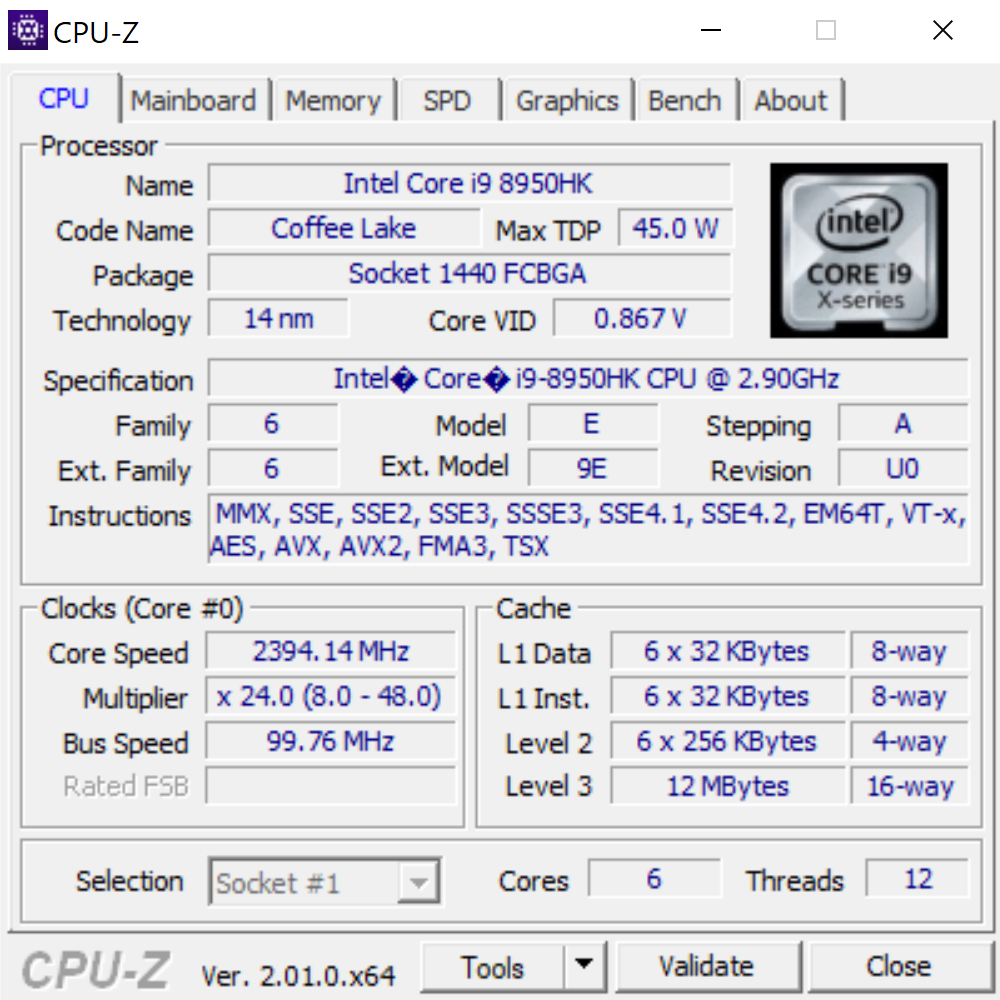

<p align="center"><br/>Информация о процессоре от CPU-Z</p>

Множество Мандельброта
```
Plain (-O2): 0078.125000 ms.
        SSE: 0031.250000 ms.
        AVX: 0015.625000 ms.
```

Наложение картинок
```
Plain (-O2): 0109.375000 ms.
        SSE: 0015.625000 ms.
        AVX: 0015.625000 ms.
```

Наложение картинок с AVX производит картинку с артефактами, требует отладки. Пока по каким-то причинам наложение картинок с помощью AVX не дает выигрыша в производительности.